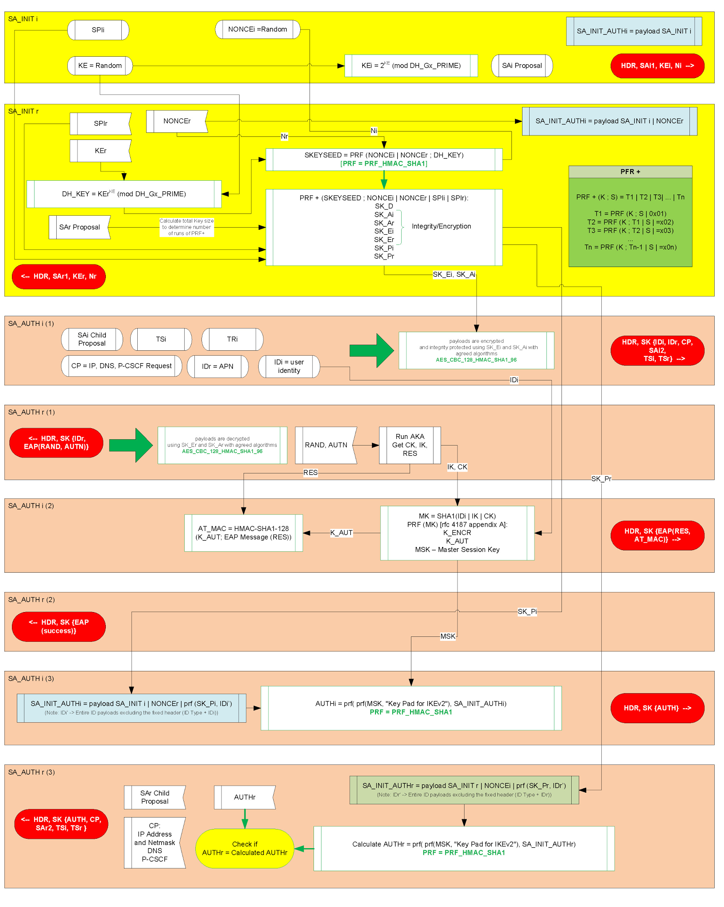
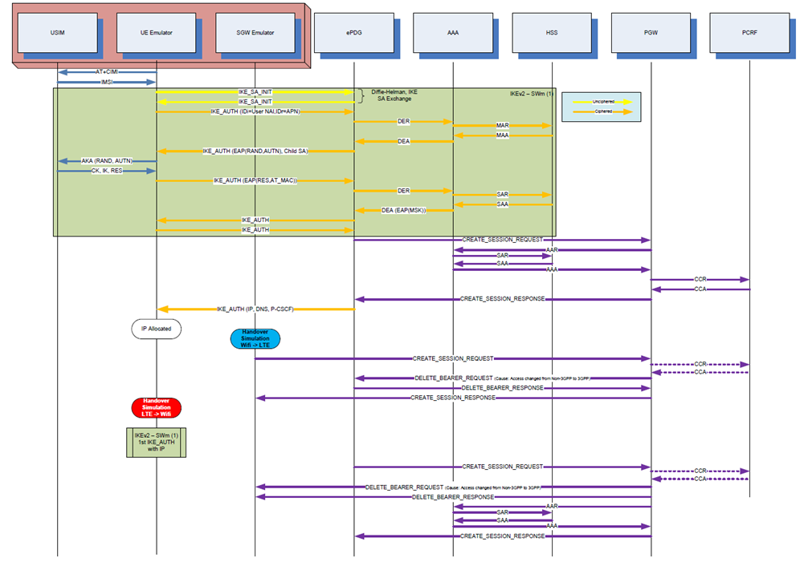
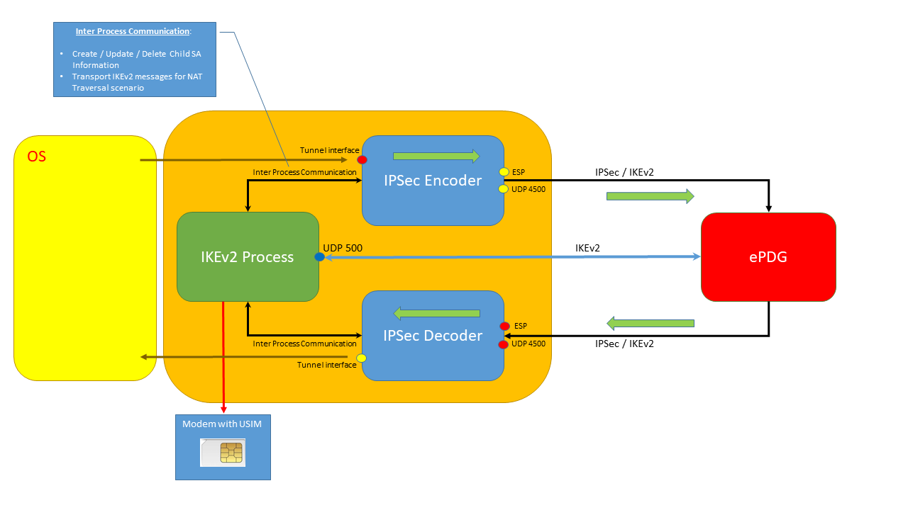
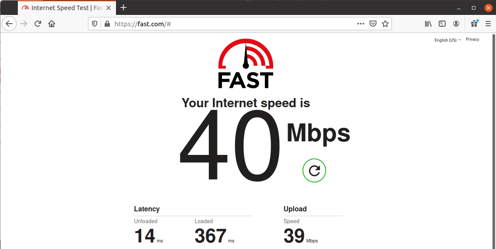

# SWu-IKEv2
# IKEv2/IPSec SWu Client Dialer

This is a SWu client emulator done in python3 that establishes an IKEv2/IPSec tunnel with an ePDG.
This application implements not only the control plane of SWu (IKEv2) but also the user plane (IPSec).

To interact with a real ePDG you need to get credentials from the USIM to derive the keys needed for EAP-AKA, so once again you need to have a modem that supports the AT command AT+CSIM, or a SmartCard reader, or even through an https server (see https://github.com/fasferraz/USIM-https-server).

Note: If no Modem/SmartCard Reader/HTTPS Server then a default CK, IK and RES will be used (check corresponding variables inside the code)

For authentication the application also accepts Ki and OP/OPC for Milenage operation (usefull for testing with developments like open5gs, where the USIM parameters are defined in the HSS/UDR).


SWu is the interface between UE and the ePDG as defined by the 3GPP, and is an IKEv2 based protocol with some minor modifications that can be found in 3GPP 33.402. The IKEv2 control plane is used to perform authentication, session creation and also to negotiate the IPSec sessions parameters to be used at the user plane level.

This application can use any network type (Wifi, Fixed, Mobile) to establish an IKEv2 Tunnel towards the ePDG and can be used in a more broader way than just the VoWifi scenario, since any APN can be requested. 
The applications outputs every single KEY and parameter used in the IKEv2 and IPSec processes, which allow us to decode the corresponding traces in wireshark if needed. 

The next picture shows a resume of the IKEv2 implementation, which parameters are sent in each message, and how the different keys are generated and used:

<p align="center"></p>

Only the first two messages are unencrypted. After the Diffie-Hellman exchange, everything is encrypted and integrity protected with keys derived from this exchange.

We need to send the NAI and APN information to the ePDG, so that it can request authentication and subscription information from the AAA/HSS for the correct IMSI. This uses the IDi and IDr IKEv2 payload types that are sent in the third message.

Some IKEv2 configuration payload were also defined by IANA for 3GPP usage like the P-CSCF IPv4 or P-CSCF IPv6 used in VoWifi.

This applications supports currently the following RFCs and options:
- IKEv2 RFC 5996
- EAP-AKA Authentication RFC 4187
- IKEv2 Encryption: AES-CBC-128 and AES-CBC-256 and NULL
- IKEv2 Pseudo Random Function: PRF-HMAC-MD5, PRF-HMAC-SHA1, PRF-HMAC-SHA2-256, PRF-HMAC-SHA2-384 and PRF-HMAC-SHA2-512
- IKEv2 Integrity: HMAC-MD5-96, HMAC-SHA1-96, HMAC-SHA2-256-128, HMAC-SHA2-384-192 and HMAC-SHA2-512-256
- Diffie-Hellman Group: 1, 2, 5, 14, 15, 16, 17 and 18 
- IPSec Encryption: AES-CBC-128, AES-CBC-256, AES-GCM-8, AES-CGM-12, AES-GCM-16 and NULL
- No Certificates
- NAT-T Detection
- IKEv2 over UDP port 500 or 4500
- IPSec over ESP or UDP port 4500
- Fast-Reauthentication
- IKE and IPSec Rekeying (app initiated or ePDG initiated)

https://www.iana.org/assignments/ikev2-parameters/ikev2-parameters.xhtml#ikev2-parameters-6


So, how can this application handle the IKEv2 authentication phase defined in 3GPP 33.402?

It needs to run the AKA algorithm in the USIM when receiving a RAND/AUTN from the ePDG in the EAP payload to get the CK and IK from the USIM, since they are needed to calculate the Master Sesssion Key. To accomplish this we need a USB modem that supports the AT Commands +CSIM, or a Smartcard Reader, or even through an https server. 

In the application we just need to set the COM port. The application can also retrieve the IMSI from the USIM Card using the AT+CIMI command, and build the NAI automatically.

The next picture shows a typical flow of activating a session through non-3GPP access, performing handover to 3GPP, and coming back to non-3GPP:

<p align="center"></p>


The application has 3 distinct processes:
- Main process that handles the IKEv2 flow states
- After establishing the SA Childs for IPSec two additional processes are created to handle the IPSec Encryption/Decryption:
- IPSec Encoder: 
    - Gets user data from tunnel interface, encrypts and sends it to ePDG
    - Receives info from main process to create/update/delete SA Child
- IPSec Decoder:
    - Gets encrypted data from ePDG, decrypts it and sends it to the tunnel interface
    - Sends decrypted IKEv2 message to main process (with NAT Traversal since IKEv2 messages are also received in UDP port 4500)

The next picture shows an high-level description of this:

<p align="center"></p>


These are the required modules needed for python3 in order to be able to run the application:

```
import serial
import struct
import socket
import random
import time
import select
import sys
import os
import fcntl
import subprocess
import multiprocessing

from optparse import OptionParser
from binascii import hexlify, unhexlify

from cryptography.hazmat.backends import default_backend
from cryptography.hazmat.primitives.asymmetric import dh
from cryptography.hazmat.primitives import hashes, hmac
from cryptography.hazmat.primitives.ciphers import Cipher, algorithms, modes

from Crypto.Cipher import AES
from cryptography.hazmat.primitives.ciphers.aead import AESGCM

from smartcard.System import readers
from smartcard.util import toHexString,toBytes

from CryptoMobile.Milenage import Milenage
```


Note 1: The smartcard module is the pyscard module found in https://pypi.org/project/pyscard/

Note 2: I added the card.USIM module (https://github.com/mitshell/card) because it handles much better blank or 3rd party USIM cards than my old USIM interaction functions (AID was hard-coded to my tests USIM, so it could not work with other USIM vendors).

These are the options currently available when starting the app:

```
python3 swu_emulator.py -h
Usage: swu_emulator.py [options]

Options:
  -h, --help            show this help message and exit
  -m MODEM, --modem=MODEM
                        modem port (i.e. COMX, or /dev/ttyUSBX), smartcard
                        reader index (0, 1, 2, ...), or server for https
  -s SOURCE_ADDR, --source=SOURCE_ADDR
                        IP address of source interface used for IKE/IPSEC
  -d DESTINATION_ADDR, --dest=DESTINATION_ADDR
                        ip address of ePDG
  -a APN, --apn=APN     APN to use
  -g GATEWAY_IP_ADDRESS, --gateway_ip_address=GATEWAY_IP_ADDRESS
                        gateway IP address
  -I IMSI, --imsi=IMSI  IMSI
  -M MCC, --mcc=MCC     MCC of ePDG (3 digits)
  -N MNC, --mnc=MNC     MNC of ePDG (3 digits)
  -K KI, --ki=KI        ki for Milenage (if not using option -m)
  -P OP, --op=OP        op for Milenage (if not using option -m)
  -C OPC, --opc=OPC     opc for Milenage (if not using option -m)
  -n NETNS, --netns=NETNS
                        Name of network namespace for tun device


```

This is an example output when running the application.

In this case, the first SA_INIT is rejected because the first proposal was not accepted by the ePDG, and altough there were other proposals that matched the ones configured in the ePDG, the KE in the SA_INIT was calculated based on the Diffie-Hellman group in the first proposal.
When this happens, the application removes the rejected proposal, and starts again.


```
# python3 swu_emulator.py -m /dev/ttyUSB2 -a internet -d 10.1.1.1


STATE 1:
-------
NAT SOURCE 36e97c5e634dc2a8cf03869e915ce7c0d07d27e2
NAT DESTINATION 24dfc1c67cd55ac92392181e812af9e67f3cb344
sending IKE_SA_INIT
received decoded message:
[[41, [0, 17, b'', b'\x00\x02']]]
received IKE_SA_INIT
REPEAT_STATE : INVALID_KE_PAYLOAD

STATE 1 (retry):
------- -------
NAT SOURCE 36e97c5e634dc2a8cf03869e915ce7c0d07d27e2
NAT DESTINATION 24dfc1c67cd55ac92392181e812af9e67f3cb344
sending IKE_SA_INIT
received decoded message:
[[33, [1, 1, b'']], [34, [2, b'\xde\x81\xdfT\t/\x97s\x0b\x833\xb1\xa3A\x1a\xec\xca\x11\xa0\xb2\xaeU\\\xef8\xf7\xbb\x02\xa9\xe8\xe4v\x84\xed\xc3\x18eT=\x9d7/0\x93T\xc7\x8a\x06DV\x19\xe5f\xc1\x97\xeaN\x07y\xc6\x9a\x90\xe0a\xcb\xa7\xc0\xb7\x85\xb2\xb4(\xe0\xd7\x8f\xed\x83\xf07p\xc1\x18h\xa4\x9b\xf9\x95ev\xa1\xdf\xf5\xc2<\xdf\xe5iU\x9b\xe1\x8f\x0f\xc8,\x05\xe5\xc5S\xfd\xdc[FCd\xed\xee\xa5y\x90\xad\xa7\xd6\xe4\xe7\xa7NM\x1a']], [40, [b'\x9a\xd6L,\x80\x05s\xbb\xe7\x95\x19\x91jK\x15\xab']], [41, [0, 16388, b'', b'c\xc1\x95\x9c\x9c7\x1b=\x81\xc3\xd3\xd6\x8c\xe9v\xb9:\xa0p\xa0']], [41, [0, 16389, b'', b'\xaa\xe0\xbdQV\xa1U\xbe\x87v\xa2y\xd10\xc4\xa2Y\xdb\x19\xf6']]]
received IKE_SA_INIT
DIFFIE-HELLMAN KEY 51912ffa710f57a28d3696f76f20ebdf4d08055fc4dab85ebd08a5f232f66514570aa95a26469ae8ab10db4884f4e7de67f1e26907665166a62a5d35198e29bfe7d9829ad5837efd29da99ecefed61351c7710f86250ddc93bcbc718a07001e6ef0d63a3442703e07ce9252a95a1edc7abe2440abdd655cf23f6eb8c47561e93
NAT SOURCE RECEIVED 63c1959c9c371b3d81c3d3d68ce976b93aa070a0
NAT SOURCE CALCULATED 63c1959c9c371b3d81c3d3d68ce976b93aa070a0
NAT DESTINATION RECEIVED aae0bd5156a155be8776a279d130c4a259db19f6
NAT DESTINATION CALCULATED 523c4c1f13fa7bfa5238263f25ba1a07f5ab62d8
SKEYSEED ebdc582da4c07807f8e5e2d36d1cc42d0a3f507b
STREAM e7ee388be0c4b75211b18dab93e83d079ad64c2c800573bbe79519916a4b15ab203fe926290771c9b63b6146c64379fd
SK_D 6b29b8892b26012f4ada820d9acabbd32fadd356
SK_AI 48b5d354c1b28295799175cfb4f0615e3c3d01ed
SK_AR a9c09c46fc077afa807a09449a2ddc93279e12c9
SK_EI 9ff51672ce0bfd2fce5c48404ebe1e6b
SK_ER 38698bff0833333543402ff0aa6eae04
SK_PI dbeab5347ac96e2873bd9022f0af349debc45e42
SK_PR 689429f414d04ee2ed249d4be0877d2ee564164f
IKE SPI INITIATOR 203fe926290771c9
IKE SPI RESPONDER b63b6146c64379fd

STATE 2:
-------
sending IKE_AUTH (1)
received decoded message:
[[46, [[36, [1, b'\nfN\xa8']], [48, [1, 2, 23, 1, [(1, b'\xcfx\xb1\x0b\x16\xae\\\x04\xf8{3\xfa\xd0\xd8~k'), (2, b'\x93\xa5l}\xc6g\x00\x00\xbf\xca\xa4\x9a\xb2\x15\xe3j'), (11, b'\x07\x04\xb6\xbb\xa5\xa4}\xa5|\xe8-\xda\xd2\xe7\xa4c'), (134, b'\x81\x05\x00\x00\xda\xa8\x0eg_\xe0k\xbf)\xa6\x7f\xcb\xd9\x1d/\x80'), (129, b'\xda\xa8\x0eg_\xe0k\xbf)\xa6\x7f\xcb\xd9\x1d/\x80'), (130, b'\x8b\x87gP[\xfd\xce\x89\xbc0\x0e\x0cCp;\xfc\xdfK\x90\x07"|\\\xa1\xe5\xc2\xa2\x82\xe9\xdeC-\x16\x83Z\xcb \x88+\x1f\xabJ\xe3\x8d\xdc\x98o>\xf5.\xdf\xfb\xc6\x0by\xe4s\xb9\xb59\xd1\x19\xc0\x87G\xb0\xe8\xb0\xdd\x93\xfe\xe7\x91\x13\xe3\xb6y\xcd\xc8\xd2')]]]]]]
received IKE_AUTH (1)
RAND cf78b10b16ae5c04f87b33fad0d87e6b
AUTN 93a56c7dc6670000bfcaa49ab215e36a
MAC 0704b6bba5a47da57ce82ddad2e7a463
RES 268D55BEDD47D44D
CK ABF0102C953342388B76211CC578085D
IK A70C0E367BBA0009EA0FA8E325E1175C
MK 5d9d41c3837eac5b8b310cb05916ec79777f4693
KENCR 3d660d02dcfad78b48a8466953ce9a52
KAUT 971220b8d251f648e3ff539c229c75cc
MSK dd170b1fe3c00369385f2dda4e538d1a0ba51be1b368755282fbda0705dacbcc831da462d06c035476a85890655af07fc7ae764768b478e1914285a67160ae98
EMSK 60e06aa212a21822a3d41c7e85ca02be4c972d46f80da0e342561199f1a4713dee8cf5c0fd9ed36f22598e10fa3a896431252c9b3942f204401fdfdb0b3ccff5
IV daa80e675fe06bbf29a67fcbd91d2f80
ENCR_DATA 8b8767505bfdce89bc300e0c43703bfcdf4b9007227c5ca1e5c2a282e9de432d16835acb20882b1fab4ae38ddc986f3ef52edffbc60b79e473b9b539d119c08747b0e8b0dd93fee79113e3b679cdc8d2
DECRYPTED DATA 8511003d3441675436773058617062462f30776b625878346d526f406e61692e6570632e6d6e633030362e6d63633236382e336770706e6574776f726b2e6f7267000000060300000000000000000000
[(133, b'4AgT6w0XapbF/0wkbXx4mRo@nai.epc.mnc456.mcc123.3gppnetwork.org'), (6, b'\x00\x00\x00\x00\x00\x00\x00\x00\x00\x00')]
NEXT REAUTH ID 4AgT6w0XapbF/0wkbXx4mRo@nai.epc.mnc456.mcc123.3gppnetwork.org

STATE 3:
-------
sending IKE_SA_AUTH (2)
received decoded message:
[[46, [[48, [3, 2]]]]]
received IKE_AUTH (2)

STATE 4:
-------
sending IKE_AUTH (3)
received decoded message:
[[46, [[39, [2, b'\xe2\x93\x90g\xcd\x95]\xd5\x17\x0e\xdd\x0e1NN)R\xbc\xce\xd8']], [47, [2, [(1, '10.10.42.134'), (3, '8.8.8.8'), (3, '1.1.1.1')]]], [33, [6, 3, b'\x03\x00\x02I']], [44, [1, [(7, 0, 0, 65535, '10.10.42.134', '10.10.42.134')]]], [45, [1, [(7, 0, 0, 65535, '0.0.0.0', '255.255.255.255')]]]]]]
received IKE_AUTH (3)
IPV4 ADDRESS ['10.10.42.134']
DNS IPV4 ADDRESS ['8.8.8.8', '1.1.1.1']
IPV6 ADDRESS []
DNS IPV6 ADDRESS []
IPSEC RESP SPI 03000249
IPSEC INIT SPI c9ef0c15
SK_IPSEC_AI ddcb383a274a993d589652f0351b8e7c8dfa53fa
SK_IPSEC_AR ae811dc18c3dbc157dd2c62839413625c7827d22
SK_IPSEC_EI 8b7f6809472d6f8ceda03eef55b35298
SK_IPSEC_ER 3a818850bd3c94448cc199c0f6b7ab30

STATE CONNECTED. Press q to quit, i to rekey ike, c to rekey child sa, r to reauth.

```

When the IKEv2/IPSec tunnel is activated, the DNS servers are updated to the ones received through IKE (and the old ones are saved), and an tunnel interface is created with the session IP.
The route table is update in order to set the default route to this tunnel interface.
To simplify the deactivation process, I choose to create two routes (0.0.0.0/1 and 128.0.0.0/1) that together form a default route, but have more priority over any already existing default route (0.0.0.0/0). When the app is deactivate, the tunnel interface is removed and the previous default route becomes the preferred one again, and the old DNS are restored.


Routing table before and after activating the IKE/IPSec tunnel:

```
BEFORE:
------

# route -n
Kernel IP routing table
Destination     Gateway         Genmask         Flags Metric Ref    Use Iface
0.0.0.0         172.16.62.2     0.0.0.0         UG    20100  0        0 ens33    <- Current default route    
172.16.62.0     0.0.0.0         255.255.255.0   U     100    0        0 ens33
172.16.63.0     0.0.0.0         255.255.255.0   U     101    0        0 ens34
172.16.168.0    0.0.0.0         255.255.255.0   U     102    0        0 ens35


AFTER:
-----

# route -n
Kernel IP routing table
Destination     Gateway         Genmask         Flags Metric Ref    Use Iface
0.0.0.0         10.10.42.134    128.0.0.0       UG    0      0        0 tun1     <- New default route 0.0.0.0/1 to tunnel interface
0.0.0.0         172.16.62.2     0.0.0.0         UG    20100  0        0 ens33    <- Old default route 0.0.0.0/0.
10.1.1.1        172.16.62.2     255.255.255.255 UGH   0      0        0 ens33    <- ePDG IP Route uses previous default gateway (you can choose this with option -g)
128.0.0.0       10.10.42.134    128.0.0.0       UG    0      0        0 tun1     <- New default route 128.0.0.0/1 to tunnel interface
172.16.62.0     0.0.0.0         255.255.255.0   U     100    0        0 ens33
172.16.63.0     0.0.0.0         255.255.255.0   U     101    0        0 ens34
172.16.168.0    0.0.0.0         255.255.255.0   U     102    0        0 ens35

```

Note: A new option was added to suport Network Namespaces (option -n).


To define the proposals and other parameters, you need to follow the examples i have in the code:

```

    #################################################################################################################    
    #####
    #####   SA Structure:
    #####   ------------
    #####
    #####   sa_list = [ (proposal 1), (proposal 2), ... , (proposal n)   ]
    #####
    #####   proposal = (Protocol ID, SPI Size) , (Transform 1), (transform 2), ... , (transform n)
    #####
    #####   transform = Tranform Type, Transform ID, (Transform Attributes)
    #####
    #####   transform attribute = Attribute type, value
    #####
    #################################################################################################################


    #################################################################################################################    
    #####
    #####   TS Structure:
    #####   ------------
    #####
    #####   ts_list = [ (ts 1), (ts 2), ... , (ts n)   ]
    #####
    #####   ts = ts_type, ip_protocol_id, start_port, end_port, starting_address, ending_address
    #####
    #################################################################################################################


    #################################################################################################################    
    #####
    #####   CP Structure:
    #####   ------------
    #####
    #####   cp_list = [ cfg_type, (attribute 1), ... , (attribute n)   ]
    #####
    #####   attribute = attribute type, value1, value2, .... (depends on the attribute type)
    #####
    #################################################################################################################


    cp_list = [
        CFG_REQUEST, 
        [INTERNAL_IP4_ADDRESS],
        [INTERNAL_IP4_DNS],
        [INTERNAL_IP6_ADDRESS],
        [INTERNAL_IP6_DNS],
        [P_CSCF_IP4_ADDRESS],
        [P_CSCF_IP6_ADDRESS]
    ]

    ts_list_initiator = [
        [TS_IPV4_ADDR_RANGE,ANY,0,65535,'0.0.0.0','255.255.255.255'],
        [TS_IPV6_ADDR_RANGE,ANY,0,65535,'::','ffff:ffff:ffff:ffff:ffff:ffff:ffff:ffff']
    ]

    ts_list_responder = [
        [TS_IPV4_ADDR_RANGE,ANY,0,65535,'0.0.0.0','255.255.255.255'],
        [TS_IPV6_ADDR_RANGE,ANY,0,65535,'::','ffff:ffff:ffff:ffff:ffff:ffff:ffff:ffff']        
    ]


    sa_list = [
    [
       [IKE,0],
       [ENCR,ENCR_NULL],
       [PRF,PRF_HMAC_MD5],
       [INTEG,AUTH_HMAC_MD5_96],
       [D_H,MODP_768_bit] 
    ]    ,
    [
       [IKE,0],
       [ENCR,ENCR_AES_CBC,[KEY_LENGTH,128]],
       [PRF,PRF_HMAC_SHA1],
       [INTEG,AUTH_HMAC_SHA1_96],
       [D_H,MODP_2048_bit] 
    ]    ,
    
    [
       [IKE,0],
       [ENCR,ENCR_AES_CBC,[KEY_LENGTH,128]],
       [PRF,PRF_HMAC_SHA1],
       [INTEG,AUTH_HMAC_SHA1_96],
       [D_H,MODP_1024_bit]  
    ]
  
    ]


    sa_list_child = [
    [
        [ESP,4],
        [ENCR,ENCR_AES_GCM_8,[KEY_LENGTH,256]],
        [INTEG,NONE],
        [ESN,ESN_NO_ESN]
    ],
    [
        [ESP,4],
        [ENCR,ENCR_AES_CBC,[KEY_LENGTH,128]],
        [INTEG,AUTH_HMAC_SHA2_256_128],
        [ESN,ESN_NO_ESN]
    ] ,
    [
        [ESP,4],
        [ENCR,ENCR_AES_CBC,[KEY_LENGTH,256]],
        [INTEG,AUTH_HMAC_SHA2_384_192],
        [ESN,ESN_NO_ESN]
    ] ,
    [
        [ESP,4],
        [ENCR,ENCR_AES_CBC,[KEY_LENGTH,256]],
        [INTEG,AUTH_HMAC_SHA2_512_256],
        [ESN,ESN_NO_ESN]
    ]     ,
    [
        [ESP,4],
        [ENCR,ENCR_AES_CBC,[KEY_LENGTH,256]],
        [INTEG,AUTH_HMAC_MD5_96],
        [ESN,ESN_NO_ESN]
    ]    ,
    [
        [ESP,4],
        [ENCR,ENCR_AES_CBC,[KEY_LENGTH,128]],
        [INTEG,AUTH_HMAC_SHA1_96],
        [ESN,ESN_NO_ESN]
    ] ,
    [
        [ESP,4],
        [ENCR,ENCR_AES_CBC,[KEY_LENGTH,256]],
        [INTEG,AUTH_HMAC_SHA1_96],
        [ESN,ESN_NO_ESN]
    ]     
    ]
```


Please note that this application is not completely error free, and there are some IKEv2 errors that are not handled.
But is fully functional, and even with a VM with 2GB RAM you can get decent IPSec speeds:

<p align="center"></p>


# Update:
- Added support for https retrieval of IMSI or RES, CK and IK (see https://github.com/fasferraz/USIM-https-server)

# Update 2:
- Output now displays the IKE decrypt table and ESP SA info to add in Wireshark to simplify the decoding of traces.

Example:

IKEv2 DECRYPTION TABLE INFO (Wireshark):
a3ae69ca51356b5c,f2ad2486dd78b7cc,400f2d3d29e5cb2070a0bddbd488aa87,18db748043497cfdd38fcba7179fcc1a,"AES-CBC-128 [RFC3602]",c222af49e595c6d1c8944bc24511193c9ca4fd99,a70286546da8f8f650739fec7f323250f105de02,"HMAC_SHA1_96 [RFC2404]"
f2ad2486dd78b7cc,a3ae69ca51356b5c,18db748043497cfdd38fcba7179fcc1a,400f2d3d29e5cb2070a0bddbd488aa87,"AES-CBC-128 [RFC3602]",a70286546da8f8f650739fec7f323250f105de02,c222af49e595c6d1c8944bc24511193c9ca4fd99,"HMAC_SHA1_96 [RFC2404]"

ESP SA INFO (wireshark):
"IPv4","172.16.62.130","172.16.168.6","0x01004004","AES-CBC [RFC3602]","0x0a9c48ccd8805a629140f0c57617bc8d","HMAC-SHA-1-96 [RFC2404]","0x912d4dbb7fd8decbfae260879ed1fe0dbe5e677b"
"IPv4","172.16.168.6","172.16.62.130","0x74a229e0","AES-CBC [RFC3602]","0xd076e607fd9dd71025c94b31bffbb3e0","HMAC-SHA-1-96 [RFC2404]","0x4d3abb30c1847c2ff1f86bbf1823068cba93fb1b"


# Update 3:
- To support different IKEv2 ENCR_NULL implementations (an algorithm which by the way, should not be supported according to the IKEv2 RFCs), a new variable was added in the code (self.sk_ENCR_NULL_pad_length):
   - If the implementation does not expect a PAD LENGTH octet, this variable should be equal to 0. 
   - If the implementation expects an octet for PAD LENGTH this variable should be equal to 1.

